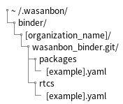

=======================
Binder Usage
=======================
Binder manages your packages' or RTCs' git repositories with yaml files.

Binder Setting Files
================================
Binder refers yaml files in following path.

``[organization_name]`` is owner of the binder settings in bellow directories.
``[example]`` is example name for yaml files. There is no naming rule but it must end with ``.yaml``.

Yaml files in ``packages`` directory manage wasanbon packages, 
and those in ``rtcs`` directory manage inidividual RTCs.

Here is yaml format example.
The format is same for package settings and RTC settings.

.. code:: yaml

    test_package01:
        description: 'This is test package01 description.'
        platform:
            macos: macos_branch
            ubuntu: ubuntu_branch
            windows: windows_branch
        type: git
        url: https://github.com/sugarsweetrobotics/test_package01.git

In ``platform`` block you can specify which branch to use on each platform.
If ``platform`` block is missing, the default branch (usually ``master`` or ``main``) will be cloned for any platforms.
For the platforms not in ``platform`` default branch will be cloned also.

Package Cloning
====================
When cloning a package, RTCs specified in ``[package]/rtc/repository.yaml`` are also cloned automatically.
These RTCs' git repositories are checked out by hash specified in ``[package]/rtc/repository.yaml`` 
but not by branch in binder settings.

RTC Cloning
====================
When cloning a new RTC in your package, 
the RTC is checked out branch specified in binder RTC settings.
